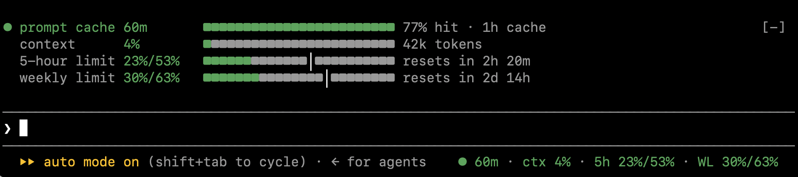
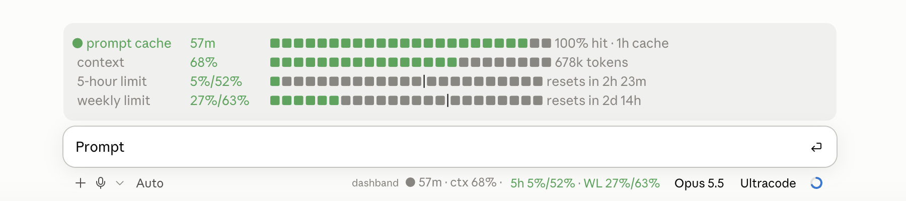

# dashband

A [Claude Code](https://code.claude.com) mod that shows the prompt cache, the context window and
your plan limits at a glance: in the prompt footer, and as a band with bars above the prompt.

In the terminal:



In the Code tab of the Claude Desktop app:



As text, the footer:

```
● 42m · ctx 31% · 5h 12%/40% · WL 70%/96%
```

and the band:

```
● prompt cache  42m       ■■■■■■■■■■■■■■■■■■■■■■■■ 100% hit · 1h cache
  context       31%       ■■■■■■■■■■■■■■■■■■■■■■■■ 310k tokens
  5-hour limit  12%/40%   ■■■■■■■■■■■■■■■■■■■■■■■■ resets in 3h 0m
  weekly limit  70%/96%   ■■■■■■■■■■■■■■■■■■■■■■■│ resets in 7h 0m
```

## Why

Claude Code caches the beginning of each request. Reading from the cache is much cheaper than
processing the context again. Once the cache expires, the next request has to write the whole
context to the cache again, which is most expensive in long sessions. dashband tells you how much
time is left before that happens, how full the context is, and whether your plan limits last
until they reset.

## What it shows

| Item | Meaning |
|---|---|
| `● 42m` | Time left until the prompt cache expires: green while more than 2 minutes are left, yellow in the last 2 minutes, gray `cold` once expired, `hot` while Claude is working |
| `100% hit` (band) | Share of the last response's input tokens read from the cache |
| `ctx 31%` | How full the context window is: green, orange from 75 %, red from 90 % |
| `5h 12%/40%` | Five-hour limit: used, and where usage would be by now if spread evenly over the window |
| `WL 70%/96%` | Weekly limit, the same way |

The limits are colored by pace, used minus expected:

| Color | Pace |
|---|---|
| green | 10 points or more below |
| gray | about on pace |
| orange | up to 15 points above |
| red | more than 15 points above |

In the terminal, the footer shows everything as one colored item. The Desktop app cuts a footer
item short, so there cache and context appear in the status line, which the app labels with the
mod's name and draws without colors, and the limits follow as a colored item. The band adds a bar
for each item. On the limit bars, `│` marks where usage would be by now.
Two minutes before the cache expires, the cache turns yellow and a notice stays for a minute,
saying how many tokens the next request would write again.

The cache lifetime, five minutes or one hour, is read from the session transcript. The plan
limits appear only on a Claude subscription.

## Requirements

- Claude Code with mod support (2.1.287 or later)
- The terminal (CLI) or the Code tab of the Claude Desktop app. Mods do not draw in the
  VS Code extension, on mobile, or in `claude -p`.
- macOS or Linux for the cache lifetime: dashband reads the transcript with `sh` and `tail`.
  Elsewhere it assumes one hour.

## Installation

dashband is listed in the `egonleitner` marketplace:

<!-- Replace OWNER with the GitHub account on first publication. -->
```bash
claude plugin marketplace add OWNER/claude-code-mods
claude plugin install dashband@egonleitner
```

Run `/reload-plugins` in an open session, or start a new one.

### Without a marketplace

Load the folder directly for one session:

```bash
claude --plugin-dir /path/to/dashband
```

To load it in every session, including the Desktop app, add the folder to `env` in
`~/.claude/settings.json`:

```json
{
  "env": {
    "CLAUDE_CODE_PLUGIN_DIRS": "/path/to/dashband"
  }
}
```

## Limitations

- The countdown estimates expiry from the time of the last response. It cannot see the cache on
  the server.
- **Desktop app: the band shows in one chat at a time.** With several chats open, the app asks
  only the active one for the band, and chats that were open when the app started may never
  show it. This is a known issue of the app
  ([anthropics/claude-code#99265](https://github.com/anthropics/claude-code/issues/99265)).
  The footer item shows in every chat; the terminal is not affected.
- **Desktop app: after an app start, a chat shows dashband once you have sent a message in it.**
  The app starts Claude Code for a chat only then.

## Development

```bash
claude plugin validate .
claude plugin test .
```

`tsconfig.json` extends the type declarations Claude Code writes to `.claude-plugin/types/` when
it loads the mod. That folder is not part of the repository; load the mod once to create it.

To trace what dashband receives and draws, create `/tmp/dashband-trace`. Each session then
writes a log there; remove the folder to stop.

Built with the help of Claude Code.

## License

[MIT](LICENSE)
